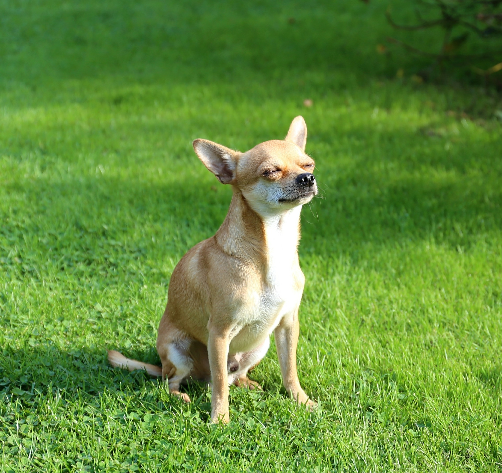
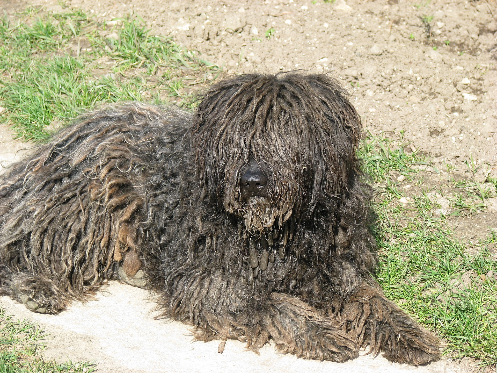
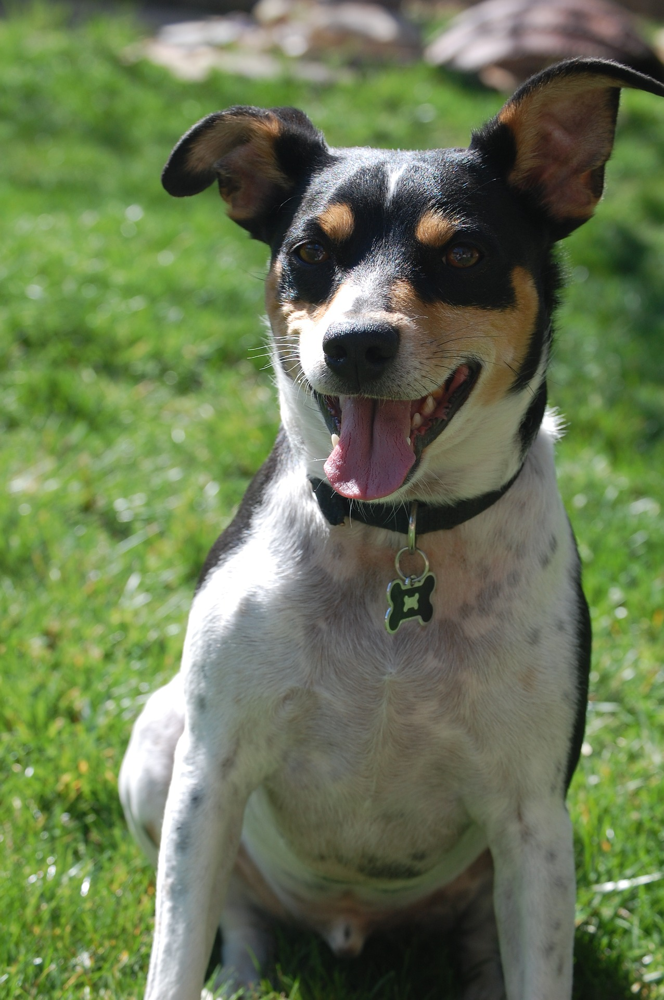

# Cute Dogs
A list of very cute dogs (with pictures).

## Chihuahua
- world's smallest dog is a Chihuahua
  - weighs less than 1 pound
- has two head shapes
  - apple shape and deer shape
- Katy will get one for her 23rd bday
  - Em will buy

## Puli
- The plural of puli is pulik (pronounced the same way)
- Officially recognized as a breed in 1936
- Makes for a stellar mop

##Rat Terrier
- Named by Teddy Roosevelt
- Sought after show dogs
  - expert jumpers and climbers
- TJ is a supermodel
